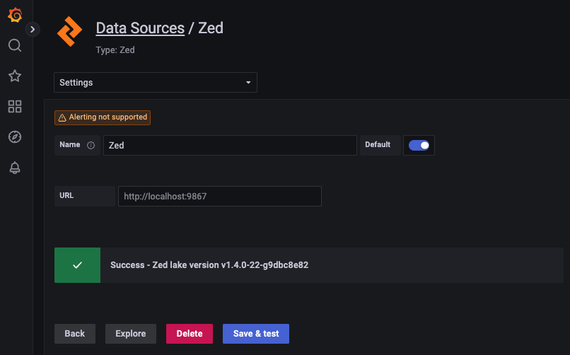
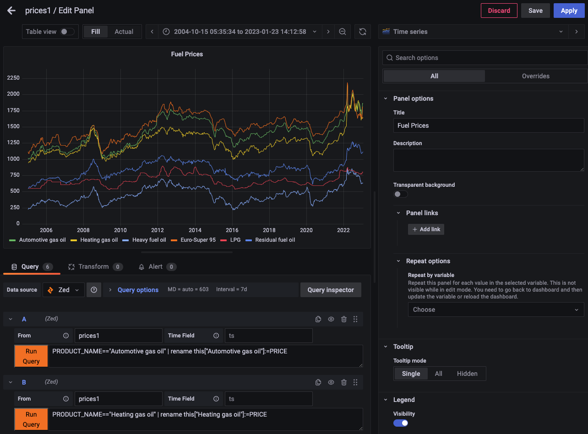
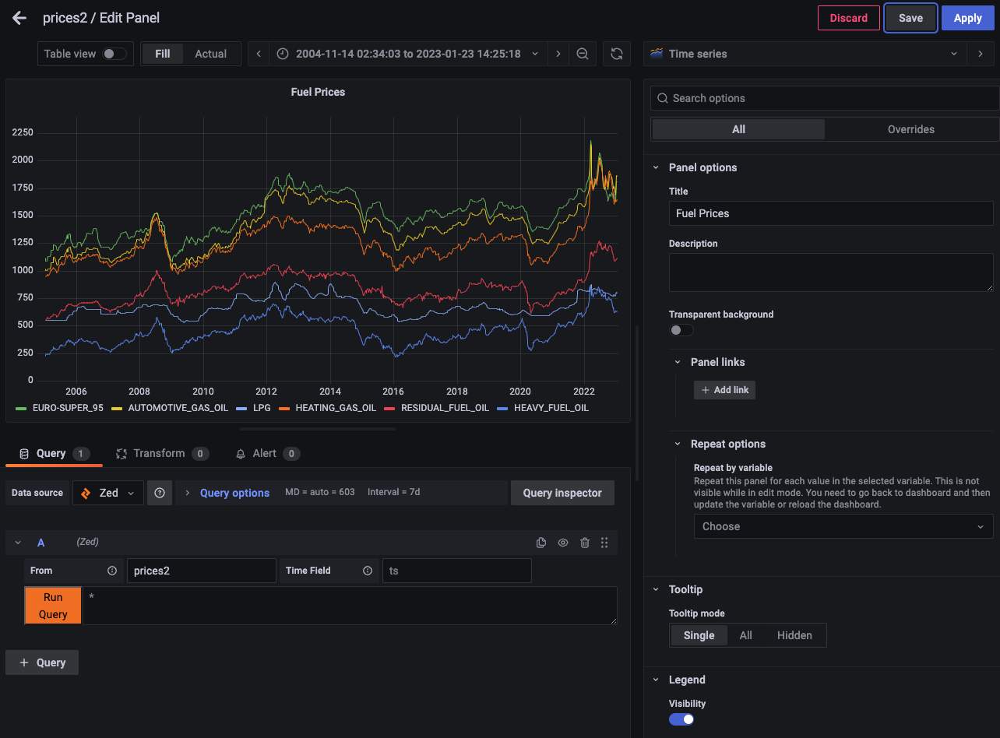
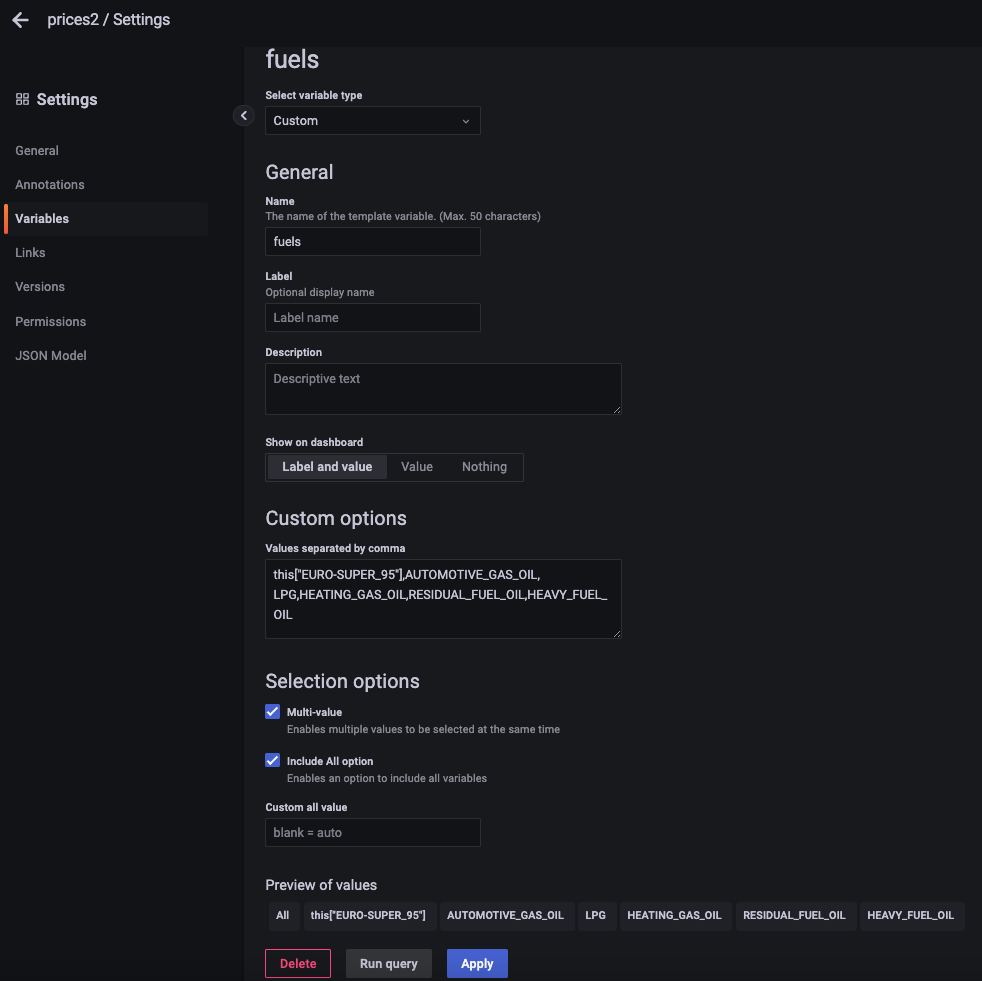
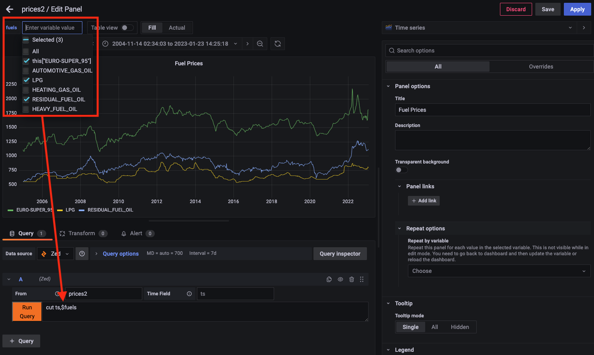
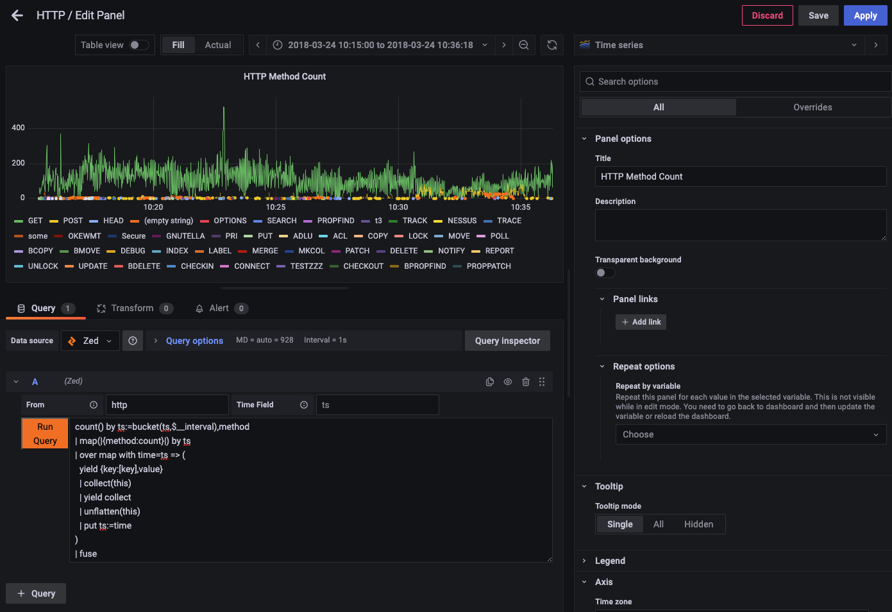
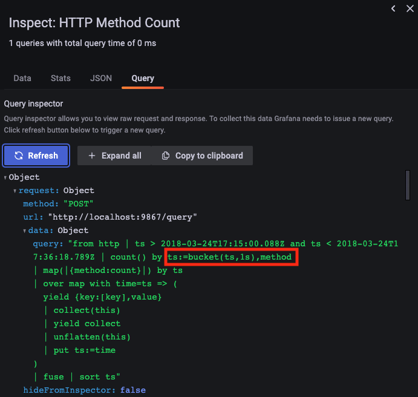

# Grafana Zed Data Source Plugin

This repository contains a prototype [data source plugin](https://grafana.com/grafana/plugins/?type=datasource)
for [Grafana](https://grafana.com/) to allow the plotting of time-series data
that's stored in [Zed lakes](https://zed.brimdata.io/docs/commands/zed/).

# Installation

As it's a prototype, these installation instructions effectively show how to
get the plugin running in a way that would allow for its further development.
The instructions below show how to do this with macOS.

1. Install Grafana and needed development tools

```
brew update
brew install grafana nvm yarn
nvm install 16.14.2
nvm use 16.14.2
```

2. Clone the plugin repo 

```
mkdir -p $HOME/grafana-plugins
git clone https://github.com/philrz/zed-datasource.git $HOME/grafana-plugins/zed
```

3. Build the plugin

```
cd $HOME/grafana-plugins/zed
yarn install
yarn dev
```

4. Start Grafana, while setting the necessary config variables to point to the
plugin directory

```
/usr/local/opt/grafana/bin/grafana-server \
    --config /usr/local/etc/grafana/grafana.ini \
    --homepath /usr/local/opt/grafana/share/grafana \
    --packaging=brew \
    cfg:default.paths.logs=/usr/local/var/log/grafana \
    cfg:default.paths.data=/usr/local/var/lib/grafana \
    cfg:default.paths.plugins="$HOME/grafana-plugins" \
    cfg:default.plugins.allow_loading_unsigned_plugins=brim-data-zed
```

Grafana should now be listening on http://localhost:3000 and you can login with
username `admin` and password `admin`.

# Zed & CORS

Unfortunately, due to [CORS](https://developer.mozilla.org/en-US/docs/Web/HTTP/CORS),
this plugin cannot currently interact with the API for an out-of-the-box Zed lake.
Issue [zed/4297](https://github.com/brimdata/zed/issues/4297) tracks the proper
enhancement to address this. In the meantime, it's possible to work around the
issue by building Zed from the
[grafana-cors-hack](https://github.com/brimdata/zed/tree/grafana-cors-hack) branch.

To compile and start the Zed service:

```
git clone -b grafana-cors-hack https://github.com/brimdata/zed.git $TMPDIR/zed
cd $TMPDIR/zed
make build
./dist/zed serve -lake scratch
```

# Best Practices

Zed is not a purpose-built time-series database. However, as a general data
platform, it can absolutely be used for storage and query of time-series data
at moderate scale.

In its current state, the plugin relies on the use of Zed queries that
prepare data for easy conversion to the
[data frames](https://grafana.com/docs/grafana/latest/developers/plugins/data-frames/)
that Grafana ultimately uses for rendering plots. Some best practices that
help achieve this:

1. **The field used as the timestamp for your time-series data should ideally be
your [pool key](https://zed.brimdata.io/docs/commands/zed#143-pool-key).**

   This way time range portion of queries initiated via the Grafana dashboard
   will scan only the minimal number of data objects in the Zed lake that are
   relevant to the query.

2. **If possible, use `ts` as the name for your timestamp field.**

   This field name matches the "out of the box" default settings for the plugin.
   However, the plugin can easily be configured to adapt to a different field
   name.

3. **Your time-series data should be of a single [shape](https://zed.brimdata.io/docs/language/overview#10-shaping).**

   Grafana's columnar data frames need to be constructed with a specific list
   of expected fields. Therefore the count of shapes returned by a query is
   first checked by the plugin and an error is shown if more than one shape is
   detected. If this occurs, the easiest way to address it is likely to use
   the [`cut` operator](https://zed.brimdata.io/docs/language/operators/cut)
   to trim the set of fields returned by the query or the
   [`fuse` operator](https://zed.brimdata.io/docs/language/operators/fuse) to
   combine the entire query result into a singe, wider shape.

Next we'll walk through some real world examples that leverage these best
practices.

# Configuration

The Zed data source can be added in Grafana via the
**Configuration > Data Sources** menu. If a lake service is listening locally
on the default TCP port `9867` (as is typical for the lake launched by the
Brim/Zui app or when `zed serve` is run by hand) the default URL setting can
be used. If your lake is listening elsewhere (e.g., with Zui Insiders it's at
http://localhost:9988) change the URL setting appropriately. When
**Save & test** is clicked, the plugin will attempt to return the value from
check the lake's `/version` endpoint. If successful, the plugin is ready for
use in dashbard panel queries.



# Example Usage in Dashboards

As described [here](https://kb.altinity.com/altinity-kb-schema-design/best-schema-for-storing-many-metrics-registered-from-the-single-source/),
different schema approaches are often used for storing time-series data. The Zed
plugin can adapt to multiple approaches, but the Zed query used in the Grafana
panel will differ. In each of the following sections we'll plot some sample
time-series data to illustrate the concepts.

## One row per metric

An example that uses this approach is the
[Weekly fuel prices (all data)](https://dgsaie.mise.gov.it/open_data_export.php?export-id=4&export-type=csv)
link in the [Italian fuel price data](https://dgsaie.mise.gov.it/open-data) that's freely
available under the [IODL 2.0 license](https://it.wikipedia.org/wiki/Italian_Open_Data_License).
We'll start by downloading a copy with the English language column headers and
peek at the data in its original form.

```
$ curl -o all_prices.csv \
  -H 'Accept-Language: en-US' \
  'https://dgsaie.mise.gov.it/open_data_export.php?export-id=4&export-type=csv'

$ head -10 all_prices.csv 
SURVEY_DATE,PRODUCT_ID,PRODUCT_NAME,PRICE,VAT,EXCISE,NET,CHANGE
2005-01-03,1,"Euro-Super 95",1115.75,185.96,558.64,371.15,-1.57
2005-01-03,2,"Automotive gas oil",1018.28,169.71,403.21,445.36,-0.33
2005-01-03,3,"Heating gas oil",948.5,158.08,403.21,387.21,-22.55
2005-01-03,5,LPG,552.5,92.08,156.62,303.8,0.22
2005-01-03,6,"Residual fuel oil",553.25,50.3,166.84,336.11,-12.21
2005-01-03,8,"Heavy fuel oil",229.52,0,31.39,198.13,-5.37
2005-01-10,1,"Euro-Super 95",1088,181.33,558.64,348.03,-27.75
2005-01-10,2,"Automotive gas oil",1004.39,167.4,403.21,433.78,-13.89
2005-01-10,3,"Heating gas oil",947.94,157.99,403.21,386.74,-0.56
```

Per the approach, we see that the date stamp is repeated for the measurement of
each of the six different fuel types. Also, being CSV data, this date field
begins life as a mere string and therefore should be converted to the Zed
`time` type as we're storing it in the lake. This will allow the values
to be used in time range selections in Grafana that will then be used in the
generated Zed queries that gather points for plotting.

Taking this into account, we'll perform some preprocessing with with `zq` to
prepare the timestamp field and also isolate a subset of the fields, then
ultimately load the data into a pool in our Zed lake. For convenience, we'll
use `ts` as the name of the converted time field since this is the plugin's
default.

```
$ zed create prices1
pool created: prices1 2KkHUfmYz7FDdix6WRf7XEjkRfO

$ zq 'cut ts:=time(SURVEY_DATE),PRODUCT_NAME,PRICE' all_prices.csv \
  | zed -use prices1 load -
(2/1) 75.95KB 75.95KB/s
2KkHZEIfCdlCQJcgO9TAGT8cNpz committed
```

Reading back a sampling of our data, we can see the successful conversion.

```
$ zed query -Z 'from prices1 | sample'
{
    ts: 2023-01-16T00:00:00Z,
    PRODUCT_NAME: "Automotive gas oil",
    PRICE: 1863.68
}
```

To plot the data for all six fuel types in the same panel, we can construct
six queries, each of which filters by category. Since the legend would
otherwise show "PRICE" for all six, we'll use Zed's
[`rename` operator](https://zed.brimdata.io/docs/language/operators/rename)  to
assign a unique field name for each before the data is handed off to Grafana.
Because we want to construct field names with spaces, we use
[field dereferencing with indexing](https://zed.brimdata.io/docs/language/overview#75-field-dereference).

Below is an example of one of the six queries, followed by the completed panel
shown in Grafana.

```
PRODUCT_NAME=="Automotive gas oil" | rename this["Automotive gas oil"]:=PRICE
```



## Each measurement (with lot of metrics) in its own row

If our data happens to be in the format with multiple metrics per row, it
becomes easy to plot with a single query. We can observe this by working with
the data in the
[Weekly fuel prices](https://dgsaie.mise.gov.it/open_data_export.php?export-id=1&export-type=csv)
link at the same page we just used.

```
$ curl -o prices2.csv \
  -H 'Accept-Language: en-US' \
  'https://dgsaie.mise.gov.it/open_data_export.php?export-id=1&export-type=csv'

$ head -4 prices2.csv 
SURVEY_DATE,EURO-SUPER_95,AUTOMOTIVE_GAS_OIL,LPG,HEATING_GAS_OIL,RESIDUAL_FUEL_OIL,HEAVY_FUEL_OIL
2005-01-03,1115.75,1018.28,552.5,948.5,553.25,229.52
2005-01-10,1088,1004.39,552.57,947.94,554.22,238.37
2005-01-17,1088.14,1004.31,551.88,952.42,562.78,245.89
```

As we see, there's now a separate column in the CSV file for each category of fuel
and each row of measurements appears with a single, shared date stamp. We'll
create a separate pool and once again convert the date stamp to a Zed `time`
field as we load it into our lake.

```
$ zed create prices2
pool created: prices2 2KkJGc9sgl2T7eq5rB0WSff26IV

$ zq 'rename ts:=SURVEY_DATE | ts:=time(ts)' prices2.csv \
  | zed -use prices2 load -
(2/1) 30.29KB 30.29KB/s
2Kbf3eLGvItvbxLA2TMQyaCab2W committed

$ zed query -Z 'from prices2 | head 1'
{
    ts: 2023-01-16T00:00:00Z,
    "EURO-SUPER_95": 1813.58,
    AUTOMOTIVE_GAS_OIL: 1863.68,
    LPG: 799.71,
    HEATING_GAS_OIL: 1651.57,
    RESIDUAL_FUEL_OIL: 1120.82,
    HEAVY_FUEL_OIL: 636.78
}
```

Because Grafana defaults to plotting all numeric fields, all six appear on our
chart if we let the plugin use its default Zed query (`*`) that pulls all points
from the pool. The only setting we had to change in our panel configuration was
to specify the pool name "prices2".



If we wanted prettier names in the legend, we could add a Zed query to our
panel config such as:

```
rename this["Euro Super 95"] := this["EURO-SUPER_95"],
       this["Automotive Gas Oil"]:=this["AUTOMOTIVE_GAS_OIL"],
       this["Heating Gas Oil"]:=this["HEATING_GAS_OIL"],
       this["Residual Fuel Oil"]:=this["RESIDUAL_FUEL_OIL"],
       this["Heavy Fuel Oil"]:=this["HEAVY_FUEL_OIL"]
```

## Converting between approaches

Now that we've seen the second approach makes it easier to plot, if you find
yourself with data that's already stored using the first approach, you could use
Zed like what's shown below to convert to the second approach. This idiom could
be used to preprocess the data before loading it into yet another pool or you
could use it as part of a Zed query in your Grafana panel config.

```
$ zed query -Z 'from prices1
                | map(|{PRODUCT_NAME:PRICE}|) by ts
                | over map with time=ts => (
                  yield {key:[key],value}
                  | collect(this)
                  | yield collect
                  | unflatten(this)
                  | put ts:=time
                )'

{
    LPG: 799.71,
    "Euro-Super 95": 1813.58,
    "Heavy fuel oil": 636.78,
    "Heating gas oil": 1651.57,
    "Residual fuel oil": 1120.82,
    "Automotive gas oil": 1863.68,
    ts: 2023-01-16T00:00:00Z
}
...
```

## Variables

The plugin does not yet support [query variables](https://grafana.com/docs/grafana/latest/developers/plugins/add-support-for-variables/#add-support-for-query-variables-to-your-data-source)
to populate [dashboard variables](https://grafana.com/docs/grafana/latest/dashboards/variables/)
with values pulled from a pool using Zed queries. However, in the meantime,
queries in panels can use variables made up of custom values defined in the
dashboard settings as long as the set of picked values can be expanded into
syntactically correct Zed.

Building on our prior example, here we've defined a multi-value variable called
"fuels" made up of the six categories of our data.



Returning to our dashboard, we now can enter a Zed query that uses
[`cut` operator](https://zed.brimdata.io/docs/language/operators/cut) to
isolate only the timestamp field and variable reference that expands into a
comma-separated field list required by `cut`. Notice that we once again made
use of [field dereferencing with indexing](https://zed.brimdata.io/docs/language/overview#75-field-dereference)
for the field `EURO-SUPER_95` since it can't be referenced as an identifier due
to its use of the character `-`.



## Aggregations and the `$__interval` variable

The examples shown thus far assume that all points in the selected time range
should be plotted at their precise values. However, in practice, screen width
and/or volume of data may make this undesirable or impossible. In these
situations it's typical to [summarize](https://zed.brimdata.io/docs/language/operators/summarize)
time-bucketed sets of points into single values that can populate a smaller
number of pixels rendered in a chart. This summarization is done by applying
an [aggregate function](https://zed.brimdata.io/docs/language/aggregates) such
as [`avg()`](https://zed.brimdata.io/docs/language/aggregates/avg),
[`min()`](https://zed.brimdata.io/docs/language/aggregates/min),
[`max()`](https://zed.brimdata.io/docs/language/aggregates/max),
[`count()`](https://zed.brimdata.io/docs/language/aggregates/count), or
[`sum()`](https://zed.brimdata.io/docs/language/aggregates/sum) to each set of
raw points.

To illustrate this example, we'll use a data source of logged
[HTTP traffic](https://github.com/brimdata/zed-sample-data/blob/main/zeek-default/http.log.gz)
found in the [zed-sample-data repository](https://github.com/brimdata/zed-sample-data).
In our example we'll plot the count of [HTTP methods](https://www.rfc-editor.org/rfc/rfc7231#page-21)
in observed requests over time.

In the query we'll construct, the use of Grafana's built-in
[`$__interval`](https://grafana.com/docs/grafana/latest/dashboards/variables/add-template-variables/#__interval)
variable is essential. The value for this variable is changed automatically by
Grafana based on the current plot width and slides easily into the `span`
parameter of Zed's [`bucket()` function](https://zed.brimdata.io/docs/language/functions/bucket).

We'll once again start by creating a pool and loading our raw test data. Since
this data already has a `time`-typed field called `ts`, we don't need to
perform the same preprocessing of the timestamp we did previously.

```
$ zed create http
pool created: http 2KkaG0Ms5mNM68kwXYbSj8tRciG

$ zq "get https://github.com/brimdata/zed-sample-data/blob/main/zeek-default/http.log.gz?raw=true" \
  | zed -use http load -
(1/1) 8.30MB 8.30MB/s
2KbzmcybYySkykAkYxTdYsNbL5o committed
```

Below is our example aggregation query, followed by the completed panel shown
in Grafana.

```
count() by ts:=bucket(ts,$__interval),method
| map(|{method:count}|) by ts
| over map with time=ts => (
  yield {key:[key],value}
  | collect(this)
  | yield collect
  | unflatten(this)
  | put ts:=time
)
| fuse
```



To see the effect of the `$__interval` variable, click the **Query Inspector**
button and click **Refresh** on the **Query** tab. Here we can see the full
query assembled by the plugin and sent to the Zed lake API based on the
current panel settings. We can see that the `$__interval` variable was
replaced with a duration string. If you zoom in/out to change the current time
range for the plot and recheck the Query Inspector, you'l see this value
change.



To understand what the rest of the Zed is doing, let's look at a sample of
data from outside Grafana starting with just the aggregation.

```
$ zed query -z 'from http
                | count() by ts:=bucket(ts,1s),method
                | sort ts'

{ts:2018-03-24T17:15:20Z,method:"GET",count:63(uint64)}
{ts:2018-03-24T17:15:20Z,method:"POST",count:1(uint64)}
{ts:2018-03-24T17:15:20Z,method:"PUT",count:1(uint64)}
{ts:2018-03-24T17:15:20Z,method:"OPTIONS",count:1(uint64)}
{ts:2018-03-24T17:15:21Z,method:"HEAD",count:1(uint64)}
{ts:2018-03-24T17:15:21Z,method:"GET",count:35(uint64)}
{ts:2018-03-24T17:15:21Z,method:"PRI",count:1(uint64)}
...
```

Two things stand out here:

1. The timestamps are repeated in what's effectively the
   [one row per metric](#one-row-per-metric) approach discussed above. For
   this reason in the next several lines of Zed we reuse the
   [idiom shown previously](#converting-between-approaches) to transform
   to the second approach we discussed that consolidate all metrics for a
   timestamp into the same row.

2. The HTTP methods vary per timestamp. For this reason we apply `fuse` at the
   end of our Zed to widen each record returned in the query response and
   add `null` values for methods that did not appear during a time interval.
   If we'd skipped the `fuse` we'd be attempting to plot multiple shapes and
   the plugin would kick back an error message (try it!)

Applying our full query and looking at a few lines of output, we can see the
effect.

```
$ zed query -Z 'from http
                | count() by ts:=bucket(ts,1s),method
                | map(|{method:count}|) by ts
                | over map with time=ts => (
                  yield {key:[key],value}
                  | collect(this)
                  | yield collect
                  | unflatten(this)
                  | put ts:=time
                )
                | fuse
                | sort ts'

{
    POST: 1 (uint64),
    ts: 2018-03-24T17:15:20Z,
    GET: 63 (uint64),
    HEAD: null (uint64),
...
```

You may notice lots of "dots" in the screenshots, which are indicative of the
sparse appearance of rarely-used HTTP methods surrounded by many `null` points.
To consider options for representing such data, refer to Grafana's
documentation for the
[connect null values](https://grafana.com/docs/grafana/latest/panels-visualizations/visualizations/time-series/#connect-null-values)
setting.

## Annotations


# Contributing

The plugin was written while following the Grafana documentation to
[build a data source plugin](https://grafana.com/tutorials/build-a-data-source-plugin/).
My JavaScript skills are pretty basic and I have no prior experience developing
Grafana plugins, so I know it has limitations. While interest in the plugin may
inspire me to continue enhancing it, I imagine someone with better skills and
experience could make progress much quicker. Please open an
[issue](https://github.com/philrz/zed-datasource/issues) before sending a pull
request.

# To Do

Having been a user of other Grafana data sources in the past, I can see some
glaring omissions in this one that form an immediate to-do list if I or anyone
else feels inspired to add further enhancements.

First, I've not yet taken steps to cover the recommended follow-on tasks from
the [Grafana docs](https://grafana.com/tutorials/build-a-data-source-plugin/)
to add support for [variables](https://grafana.com/docs/grafana/latest/developers/plugins/add-support-for-variables/),
[annotations](https://grafana.com/docs/grafana/latest/developers/plugins/add-support-for-annotations/),
and [Explore queries](https://grafana.com/docs/grafana/latest/developers/plugins/add-support-for-explore-queries/).
Also, while Grafana has traditionally been focused on time-series data, their
docs note that a plugin can also be a [logs data source](https://grafana.com/docs/grafana/latest/developers/plugins/build-a-logs-data-source-plugin/). Given
the diverse data that can be stored in Zed lakes, this would also seem to be a
logical enhancement.

Specifically for the case of variables, I suspect explicit support for
[`$__interval`](https://grafana.com/docs/grafana/latest/variables/variable-types/global-variables/#__interval)
would be helpful. Right now all time bucketing must be expressed explicitly
in the Zed query itself, but proper support for `$__interval` should make it
possible to set the bucketing dynamically based on the pixels available in a
given panel.

Another fundamental limitation of the plugin currently is that it's only
capable of handling one time-series per query. Consider a Zed query such as:

```
$ zed query -use http -f table 'count() by every(1s),method'
ts                   method           count
2018-03-24T17:15:20Z OPTIONS          1
2018-03-24T17:15:20Z POST             1
2018-03-24T17:15:20Z GET              63
2018-03-24T17:15:20Z PUT              1
2018-03-24T17:15:21Z GET              35
2018-03-24T17:15:21Z HEAD             1
2018-03-24T17:15:21Z PRI              1
...
```

More advanced plugins expose knobs that would allow the easy separation of this
response into multiple separate time-series that could each be plotted with an
appropriate label, e.g., based on the different HTTP methods in this case.
Until the Zed plugin is enhanced to handle this, for now you'd need to create
one query per time-series, e.g.:

```
$ zed query -use http -f table 'count() where method=="GET" by every(1s)'
ts                   count
2018-03-24T17:15:20Z 63
2018-03-24T17:15:21Z 35

$ zed query -use http -f table 'count() where method=="POST" by every(1s)'
ts                   count
2018-03-24T17:15:20Z 1
2018-03-24T17:15:21Z 0
```

Finally, due to its prototype nature, the plugin is currently
[unsigned](https://grafana.com/docs/grafana/latest/developers/plugins/sign-a-plugin/)
and not in any way [packaged or distributed](https://grafana.com/docs/grafana/latest/developers/plugins/package-a-plugin/) for easy installation in non-test
Grafana environments.

# Appendix: Converting between the two approaches

Debug tips
- Take the query out of the Query Inspector and run it with `zed query` or in Brim/Zui. Some common mistakes:
Your timestamp field might not be correct