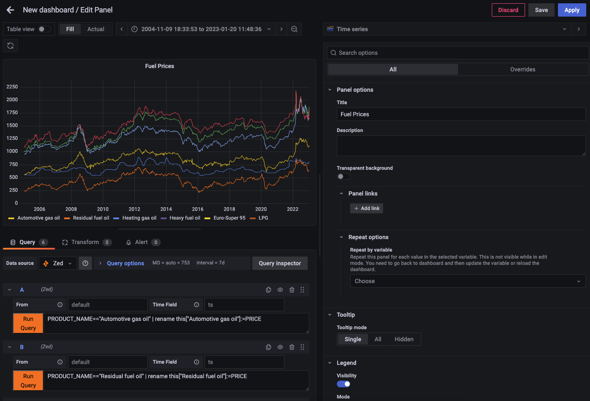
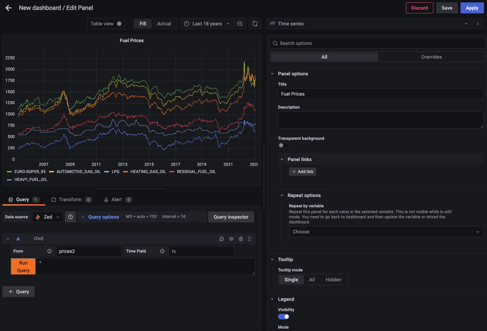
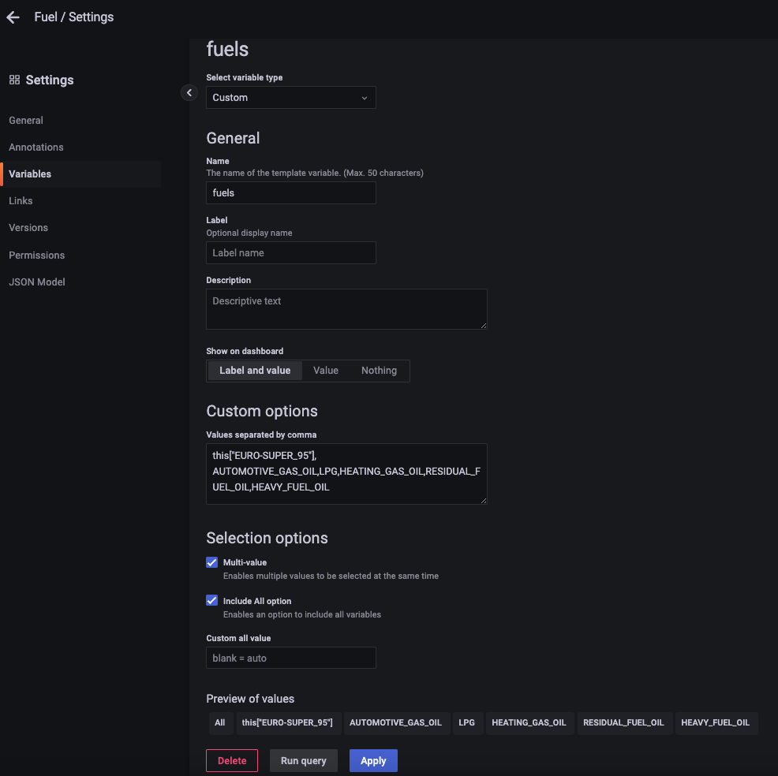
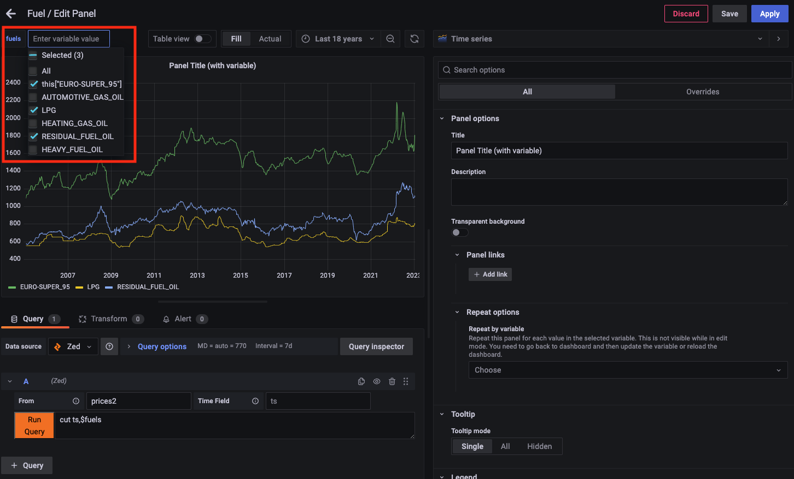

# Grafana Zed Data Source Plugin

This repository contains a prototype [data source plugin](https://grafana.com/grafana/plugins/?type=datasource)
for [Grafana](https://grafana.com/) to allow the plotting of time-series data
that's stored in [Zed lakes](https://zed.brimdata.io/docs/commands/zed/).

# Installation

As it's a prototype, these installation instructions effectively show how to
get the plugin running in a way that would allow for its further development.
I happen to use macOS on the desktop, so these instructions cover that case.

1. Install Grafana and needed development tools

```
brew update
brew install grafana nvm yarn
nvm install 16.14.2
nvm use 16.14.2
```

2. Clone the plugin repo 

```
mkdir -p $HOME/grafana-plugins
git clone https://github.com/philrz/zed-datasource.git $HOME/grafana-plugins/zed
```

3. Build the plugin

```
cd $HOME/grafana-plugins/zed
yarn install
yarn dev
```

4. Start Grafana, while setting the necessary config variables to point to the
plugin directory

```
/usr/local/opt/grafana/bin/grafana-server \
    --config /usr/local/etc/grafana/grafana.ini \
    --homepath /usr/local/opt/grafana/share/grafana \
    --packaging=brew \
    cfg:default.paths.logs=/usr/local/var/log/grafana \
    cfg:default.paths.data=/usr/local/var/lib/grafana \
    cfg:default.paths.plugins="$HOME/grafana-plugins" \
    cfg:default.plugins.allow_loading_unsigned_plugins=brim-data-zed
```

Grafana should now be listening on http://localhost:3000 and you can login with
username `admin` and password `admin`.

# Zed & CORS

Unfortunately, due to a problem with [CORS](https://developer.mozilla.org/en-US/docs/Web/HTTP/CORS),
this plugin cannot currently interact with the API for out-of-the-box Zed lake.
Issue [zed/4297](https://github.com/brimdata/zed/issues/4297) tracks the proper
fix. In the meantime, it's possible to work around the issue by building Zed
from the [grafana-cors-hack](https://github.com/brimdata/zed/tree/grafana-cors-hack) branch.

To compile and start the Zed service:

```
git clone -b grafana-cors-hack https://github.com/brimdata/zed.git $TMPDIR/zed
cd $TMPDIR/zed
make build
./dist/zed serve -lake scratch
```

# Best Practices

Zed is not a purpose-built time-series database. However, as a general data
platform, it can absolutely be used for storage and query of such data at
moderate scale.

In its current state, the plugin relies on the use of Zed queries that
prepare data for easy conversion to the
[data frames](https://grafana.com/docs/grafana/latest/developers/plugins/data-frames/)
that Grafana ultimately uses for rendering plots. Some best practices that
help achieve this:

1. The field used as the timestamp for your time-series data should ideally be
your [pool key](https://zed.brimdata.io/docs/commands/zed#143-pool-key).

This
way time range queries initiated in the Grafana dashboard will scan only the
minimal number of data objects relevant to the query.

2. If possible, name your pool `default` and your timestamp field `ts`.

These names match the "out of the box" default settings for the plugin.
However, the plugin can easily be configured to adapt to different names for
your environment.

3. Your time-series data should ideally be of a single
[shape](https://zed.brimdata.io/docs/language/overview#10-shaping).

This is because the plugin uses the fields in the first row of returned query
results to create the fields in the data frame that will ultimately store the
points rendered by Grafana, so rows of a different shape later returned that
have more/different fields will not fit into the data frame and the plots will
therefore have unpredictable output. If your data has multiple shapes, use
the [`fuse`](https://zed.brimdata.io/docs/language/operators/fuse) operator in
your query to widen it to a single shape that incorporates all fields.

4. Convert any `null` values in your numeric fields to `0`.

Next we'll walk through some real world examples that leverage these best
practices.

# Configuration

# Example Usage in Dashboards

As described [here](https://kb.altinity.com/altinity-kb-schema-design/best-schema-for-storing-many-metrics-registered-from-the-single-source/),
we often encounter different schema approaches for time-series data. The Zed
plugin can adapt to multiple approaches, but the Zed query used in the Grafana
panel will differ. In each of the following sections we'll plot some sample
time-series data to illustrate the concepts.

## One row per metric

An example of this approach is the
["Weekly fuel prices (all data)"](https://dgsaie.mise.gov.it/open_data_export.php?export-id=4&export-type=csv)
link in the [Italian fuel price data](https://dgsaie.mise.gov.it/open-data) that's freely
available under the [IODL 2.0 license](https://it.wikipedia.org/wiki/Italian_Open_Data_License).
We'll start by downloading a copy with the English langauge column headers and
peek at the data in its original form.

```
$ curl -o all_prices.csv \
  -H 'Accept-Language: en-US' \
  'https://dgsaie.mise.gov.it/open_data_export.php?export-id=4&export-type=csv'

$ head -10 all_prices.csv 
SURVEY_DATE,PRODUCT_ID,PRODUCT_NAME,PRICE,VAT,EXCISE,NET,CHANGE
2005-01-03,1,"Euro-Super 95",1115.75,185.96,558.64,371.15,-1.57
2005-01-03,2,"Automotive gas oil",1018.28,169.71,403.21,445.36,-0.33
2005-01-03,3,"Heating gas oil",948.5,158.08,403.21,387.21,-22.55
2005-01-03,5,LPG,552.5,92.08,156.62,303.8,0.22
2005-01-03,6,"Residual fuel oil",553.25,50.3,166.84,336.11,-12.21
2005-01-03,8,"Heavy fuel oil",229.52,0,31.39,198.13,-5.37
2005-01-10,1,"Euro-Super 95",1088,181.33,558.64,348.03,-27.75
2005-01-10,2,"Automotive gas oil",1004.39,167.4,403.21,433.78,-13.89
2005-01-10,3,"Heating gas oil",947.94,157.99,403.21,386.74,-0.56
```

Per the appaoch, we see that the datestamp is repeated for the measurement of
each of the six differnet fuel types. Also, being CSV data, this date field
begins life as a mere string and therefore should be converted to the Zed
`time` type as we're storing it in the lake, since this will allow the values
to be used in time range selections in Grafana that will then be used in the
Zed queries that gather points relevant to a given plot.

Taking this into account, we'll perform this conversion with `zq` while also
isolating a subset of the fields and ultimately loading the data into a pool
in our Zed lake. For convenience, we'll use `ts` as the name of the converted
time field since this is the plugin's expected default.

```
$ zed create default

$ zq 'cut ts:=time(SURVEY_DATE),PRODUCT_NAME,PRICE' all_prices.csv \
  | zed -use default load -
(2/1) 75.95KB 75.95KB/s
2KbV5PBvsphUJP9kbd80ky0gOU9 committed
```

Reading back a sampling of our data, we can see the successful conversion.

```
$ zed query -Z 'from default | sample'
{
    ts: 2023-01-16T00:00:00Z,
    PRODUCT_NAME: "Automotive gas oil",
    PRICE: 1863.68
}
```

To plot the data for all fuel types in the same panel, we can construct six
different queries that filter them by category. Since the legend would
otherwise show "PRICE" for all six, we'll use Zed's
[`rename`](https://zed.brimdata.io/docs/language/operators/rename) operator to
assign a unique field name for each before the data is handed off to Grafana.
Because we want to construct field names with spaces, we use
[field dereferencing with indexing](https://zed.brimdata.io/docs/language/overview#75-field-dereference).



## Each measurement (with lot of metrics) in its own row

If our data happens to be in the format with multiple metrics per row, it
becomes easy to plot with a single query. We can observe this by working with
the data in the
[Weekly fuel prices](https://dgsaie.mise.gov.it/open_data_export.php?export-id=1&export-type=csv)
link at the same page we just used.

```
$ curl -o prices2.csv \
  -H 'Accept-Language: en-US' \
  'https://dgsaie.mise.gov.it/open_data_export.php?export-id=1&export-type=csv'

$ head -4 prices2.csv 
SURVEY_DATE,EURO-SUPER_95,AUTOMOTIVE_GAS_OIL,LPG,HEATING_GAS_OIL,RESIDUAL_FUEL_OIL,HEAVY_FUEL_OIL
2005-01-03,1115.75,1018.28,552.5,948.5,553.25,229.52
2005-01-10,1088,1004.39,552.57,947.94,554.22,238.37
2005-01-17,1088.14,1004.31,551.88,952.42,562.78,245.89

$ zed query -Z 'from prices2 | head 1'
{
    ts: 2023-01-16T00:00:00Z,
    "EURO-SUPER_95": 1813.58,
    AUTOMOTIVE_GAS_OIL: 1863.68,
    LPG: 799.71,
    HEATING_GAS_OIL: 1651.57,
    RESIDUAL_FUEL_OIL: 1120.82,
    HEAVY_FUEL_OIL: 636.78
}
```

As we see, there's now a separate column in the CSV for each category of fuel
and each row of measurements appears with a single, shared datestamp. We'll
create a separate pool and once again convert the datestamp to a Zed `time`
field as we load it into our lake.

```
$ zed create prices2

$ zq 'rename ts:=SURVEY_DATE | ts:=time(ts)' prices2.csv \
  | zed -use prices2 load -
(2/1) 30.29KB 30.29KB/s
2Kbf3eLGvItvbxLA2TMQyaCab2W committed
```

Because Grafana defaults to plotting all numeric fields, all six appear on our
chart by just using the default `*` Zed query that pulls all points from the
pool. The only setting we had to change in our panel configuration was to
specify the pool name "prices2".



If we wanted prettier names in the legend, we could add a Zed query to our
panel config such as:

```
rename this["Euro Super 95"] := this["EURO-SUPER_95"],
       this["Automotive Gas Oil"]:=this["AUTOMOTIVE_GAS_OIL"],
       this["Heating Gas Oil"]:=this["HEATING_GAS_OIL"],
       this["Residual Fuel Oil"]:=this["RESIDUAL_FUEL_OIL"],
       this["Heavy Fuel Oil"]:=this["HEAVY_FUEL_OIL"]
```

## Variables

The plugin does not yet support [query variables](https://grafana.com/docs/grafana/latest/developers/plugins/add-support-for-variables/#add-support-for-query-variables-to-your-data-source)
to populate dashboard [variables](https://grafana.com/docs/grafana/latest/dashboards/variables/)
with values pulled using Zed queries. However, in the meantime, queries in
panels can use variables made up of custom sets of values defined in the
dashboard settings as long as the set of picked values can be expanded into
syntactically correct Zed.

Building on our prior example, here we've defined a multi-value variable called
"fuels" made up of the six categoies of our data.



Returning to our dashboard, we now can enter a Zed query that uses
[`cut` operator](https://zed.brimdata.io/docs/language/operators/cut) to
isolate only the timestamp field and the expanded variable that holds our set
of picked fuels. Notice that we once again made use of
[field dereferencing with indexing](https://zed.brimdata.io/docs/language/overview#75-field-dereference)
for the field `EURO-SUPER_95` since it can't be referened as an identifier due
to its use of the character `-`.



## Aggregations and the `$__interval` variable

The examples shown thus far all assume that all points in the selected time
should be plotted at their precise values. However, in practice, screen width
and/or volume of data may make this undesirable or impossible. In these
situations it's typical to [summarize](https://zed.brimdata.io/docs/language/operators/summarize)
time-bucketed sets of points into single values that can populate a smaller
number of points rendered in a chart. This summarization is done by applying
an [aggregate function](https://zed.brimdata.io/docs/language/aggregates) to
each set of raw points, such as [`avg()`](https://zed.brimdata.io/docs/language/aggregates/avg),
[`min()`](https://zed.brimdata.io/docs/language/aggregates/min),
[`max()`](https://zed.brimdata.io/docs/language/aggregates/max),
[`count()`](https://zed.brimdata.io/docs/language/aggregates/count), or
[`sum()`](https://zed.brimdata.io/docs/language/aggregates/sum).

To illustrate this example, we'll use a data source of logged
[HTTP traffic](https://github.com/brimdata/zed-sample-data/blob/main/zeek-default/http.log.gz)
found in the [zed-sample-data repository](https://github.com/brimdata/zed-sample-data).
In our example we'll plot the count of [HTTP methods](https://www.rfc-editor.org/rfc/rfc7231#page-21)
in observed requests over time.

In the query we'll construct, the use of Grafana's
[`$__interval`](https://grafana.com/docs/grafana/latest/dashboards/variables/add-template-variables/#__interval)
varaible is key. The value for this variable that Grafana changes based on the
current plot width slides easily into the `span` parameter of Zed's
[`bucket()` function](https://zed.brimdata.io/docs/language/functions/bucket).

We'll once again start by creating a pool and loading our test data. Since
this data already has a `time`-typed field called `ts`, we don't need to
perform the same preprocessing we did previously.

```
$ zed create http

$ zq "get https://github.com/brimdata/zed-sample-data/blob/main/zeek-default/http.log.gz?raw=true" \
  | zed -use http load -
(1/1) 8.30MB 8.30MB/s
2KbzmcybYySkykAkYxTdYsNbL5o committed
```


# Contributing

The plugin was written while following the Grafana documentation to
[build a data source plugin](https://grafana.com/tutorials/build-a-data-source-plugin/).
My JavaScript skills are pretty basic and I have no prior experience developing
Grafana plugins, so I know it has limitations. While interest in the plugin may
inspire me to continue enhancing it, I imagine someone with better skills and
experience could make progress much quicker. Please open an
[issue](https://github.com/philrz/zed-datasource/issues) before sending a pull
request.

# To Do

Having been a user of other Grafana data sources in the past, I can see some
glaring omissions in this one that form an immediate to-do list if I or anyone
else feels inspired to add further enhancements.

First, I've not yet taken steps to cover the recommended follow-on tasks from
the [Grafana docs](https://grafana.com/tutorials/build-a-data-source-plugin/)
to add support for [variables](https://grafana.com/docs/grafana/latest/developers/plugins/add-support-for-variables/),
[annotations](https://grafana.com/docs/grafana/latest/developers/plugins/add-support-for-annotations/),
and [Explore queries](https://grafana.com/docs/grafana/latest/developers/plugins/add-support-for-explore-queries/).
Also, while Grafana has traditionally been focused on time-series data, their
docs note that a plugin can also be a [logs data source](https://grafana.com/docs/grafana/latest/developers/plugins/build-a-logs-data-source-plugin/). Given
the diverse data that can be stored in Zed lakes, this would also seem to be a
logical enhancement.

Specifically for the case of variables, I suspect explicit support for
[`$__interval`](https://grafana.com/docs/grafana/latest/variables/variable-types/global-variables/#__interval)
would be helpful. Right now all time bucketing must be expressed explicitly
in the Zed query itself, but proper support for `$__interval` should make it
possible to set the bucketing dynamically based on the pixels available in a
given panel.

Another fundamental limitation of the plugin currently is that it's only
capable of handling one time-series per query. Consider a Zed query such as:

```
$ zed query -use http -f table 'count() by every(1s),method'
ts                   method           count
2018-03-24T17:15:20Z OPTIONS          1
2018-03-24T17:15:20Z POST             1
2018-03-24T17:15:20Z GET              63
2018-03-24T17:15:20Z PUT              1
2018-03-24T17:15:21Z GET              35
2018-03-24T17:15:21Z HEAD             1
2018-03-24T17:15:21Z PRI              1
...
```

More advanced plugins expose knobs that would allow the easy separation of this
response into multiple separate time-series that could each be plotted with an
appropriate label, e.g., based on the different HTTP methods in this case.
Until the Zed plugin is enhanced to handle this, for now you'd need to create
one query per time-series, e.g.:

```
$ zed query -use http -f table 'count() where method=="GET" by every(1s)'
ts                   count
2018-03-24T17:15:20Z 63
2018-03-24T17:15:21Z 35

$ zed query -use http -f table 'count() where method=="POST" by every(1s)'
ts                   count
2018-03-24T17:15:20Z 1
2018-03-24T17:15:21Z 0
```

Finally, due to its prototype nature, the plugin is currently
[unsigned](https://grafana.com/docs/grafana/latest/developers/plugins/sign-a-plugin/)
and not in any way [packaged or distributed](https://grafana.com/docs/grafana/latest/developers/plugins/package-a-plugin/) for easy installation in non-test
Grafana environments.

# Appendix: Converting between the two approaches